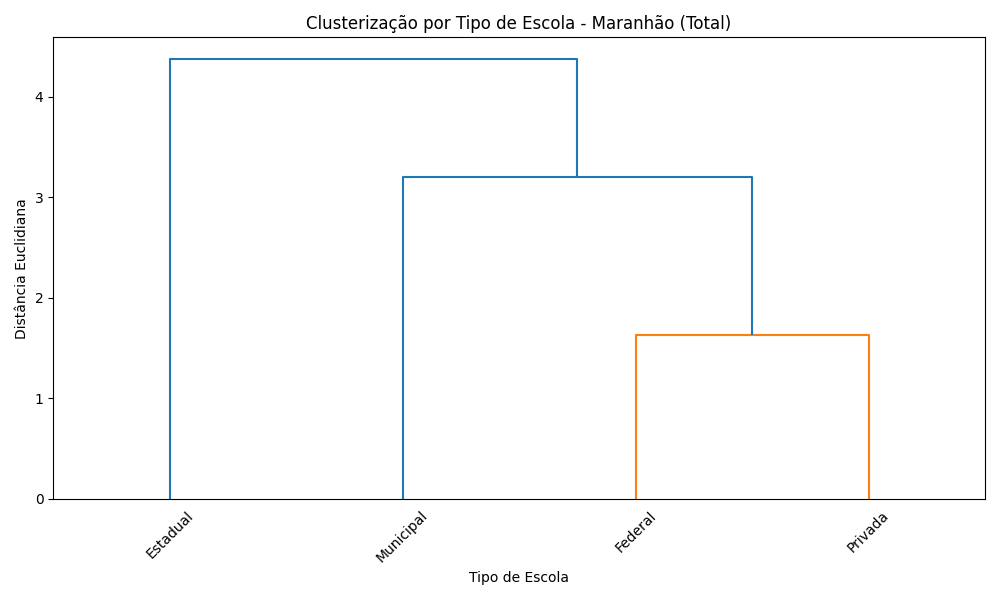

# Análise de Clusterização Hierárquica - Dados Educacionais do Maranhão



## 📌 Sobre o Projeto
Análise de rendimento escolar (aprovados/reprovados/abandonos) por tipo de escola no Maranhão utilizando:
- Clusterização hierárquica (método Ward)
- Visualização com dendrogramas
- Frontend interativo para apresentação

## 🛠️ Tecnologias
- **Backend**: Python (`pandas`, `scipy`, `sklearn`)
- **Frontend**: HTML/CSS/JavaScript
- **Visualização**: Matplotlib (dendrogramas)

## 📂 Estrutura do Projeto
```
.
├── data/               # Dados brutos (se aplicável)
├── output/             # Resultados em PNG
│   ├── Anos_Iniciais.png
│   ├── Anos_Finais.png
│   └── Total.png
├── docs/               # Documentação adicional
├── index.html          # Dashboard interativo
├── main.py             # Script de análise
└── README.md           # Este arquivo
```

## 🚀 Como Executar
```bash
# Clone o repositório
git clone https://github.com/cicerodesousacardoso/Clusterizacao-Educacional-MA.git

# Instale as dependências (Python 3.8+ necessário)
pip install pandas scipy scikit-learn matplotlib

# Execute a análise
python main.py

# Visualize os resultados
abra o arquivo index.html no navegador
```

## 📊 Resultados Esperados
- Dendrogramas comparando:
  - Anos iniciais do ensino fundamental
  - Anos finais do ensino fundamental
  - Visão consolidada (Total)

## 👨💻 Autor
[Cicero de Sousa Cardoso](https://github.com/cicerodesousacardoso)

## 📄 Licença
Este projeto está sob a licença MIT - veja o arquivo [LICENSE](LICENSE) (opcional)
